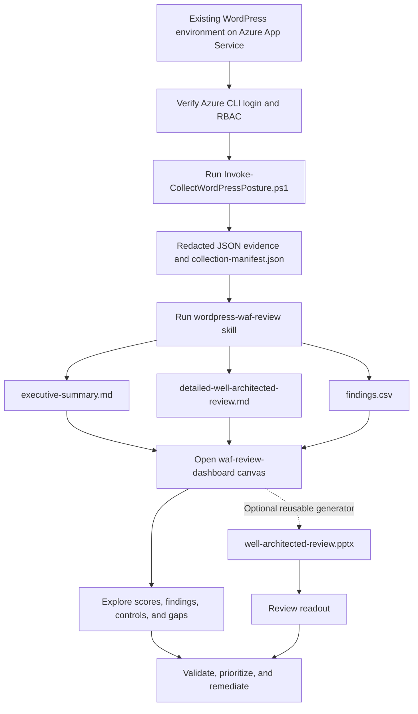

# Azure WordPress Well-Architected Review Toolkit

> **GitHub Copilot skill and app canvases included:** Generate an evidence-based WordPress Well-Architected review, follow the guided workflow, and explore the interactive dashboard. PowerPoint is an optional follow-up, not a prerequisite for viewing results. Ask Copilot Chat to **"Run the WordPress WAF review using evidence in `<evidence-folder>` and open the report dashboard"**. See [SKILLSREADME.md](SKILLSREADME.md) for usage and the [workflow README](.github/extensions/waf-review-workflow/README.md) for the guided experience.

This repository is now focused on **reviewing** a WordPress on Azure App Service workload. It no longer contains deployment templates, operational backup/restore helpers, or bundled sample evidence. Use it to:

- Collect redacted Azure configuration evidence from an existing resource group.
- Score that evidence against the bundled 157-control WordPress Well-Architected checklist.
- Generate Markdown and CSV review deliverables, with an optional PowerPoint readout.
- Open an interactive dashboard for the generated review output.

## Repository layout

```
Review/
  PSScripts/                                          # Evidence collector entry point and per-resource collectors
  Presentation/                                       # Reusable executive/detailed PowerPoint generator and tests
  README.md                                          # Evidence-collection workflow and collector output details
.github/skills/wordpress-waf-review/                 # Copilot skill that generates the scored WAF review
  SKILL.md
  references/                                        # Checklist, evidence map, scoring rubric, report templates, deck template
.github/extensions/waf-review-dashboard/             # Copilot app canvas that visualizes generated reports
  extension.mjs
  lib/                                               # Report parsing, discovery, and loopback server code
  ui/                                                # Dashboard HTML, CSS, and JavaScript
  README.md
.github/extensions/waf-review-workflow/              # Copilot app canvas that guides the full review workflow
  extension.mjs
  README.md
SKILLSREADME.md                                      # Skill invocation, inputs, outputs, and prerequisites
README.md                                           # This overview
```

## High-level workflow

A review starts with a deployed WordPress environment in Azure. The environment does not need to have been deployed from this repository, but it must be accessible to the Azure identity running the collector.

1. **Prepare access.** Install PowerShell 7 and Azure CLI, run `az login`, select the correct subscription, and ensure the signed-in identity has at least `Reader` access. `Monitoring Reader` and `Security Reader` improve evidence coverage.
2. **Collect evidence.** Run `Review/PSScripts/Invoke-CollectWordPressPosture.ps1` against the deployed resource group. The read-only collector inventories supported Azure resources and writes redacted JSON evidence, including `collection-manifest.json`, to the chosen output directory.
3. **Generate the review.** Run the `wordpress-waf-review` skill against the evidence directory. It assesses the bundled [AzureWordPressChecklist.md](.github/skills/wordpress-waf-review/references/AzureWordPressChecklist.md) and writes three outputs to `Review/reports/<evidence-folder-name>-reports/`: `executive-summary.md`, `detailed-well-architected-review.md`, and `findings.csv`.
4. **Visualize the report.** Open the included `waf-review-dashboard` canvas in the GitHub Copilot app. It reads the two Markdown files and CSV, then displays score, coverage, pillars, findings, all 157 controls, remediation plan, and collection gaps interactively. The canvas does not read the PPTX, call Azure, modify reports, or recalculate scores.
5. **Review and act on findings.** Confirm evidence gaps and manually verified controls, prioritize findings, and use the recommendations to plan remediation. Resource changes are not performed by the collector, review skill, or dashboard.
6. **Optionally generate PowerPoint.** Select Step 9 in the workflow, or run the [presentation generator](Review/Presentation/README.md) against the finished reports. Executive mode defaults to 10–15 slides; detailed mode expands findings. No second assessment is performed.

Open the `waf-review-workflow` canvas for eight required steps: validate dependencies, connect scope, inventory, collect, package, extract, assess, and display. A ninth PowerPoint step is optional and never runs automatically. Start a named run, upload an existing collector ZIP, or reopen a previous run.



## Prerequisites

- **PowerShell 7+** for the evidence collector.
- **Azure CLI**, authenticated with `az login`.
- **Azure RBAC:** `Reader` for most evidence; `Monitoring Reader`, `Security Reader`, and permission to read Key Vault object metadata improve coverage.
- **Only for optional PowerPoint:** Node.js and the pinned dependencies installed once with `npm ci --prefix .\Review\Presentation`. Plain generation does not need Python or PowerPoint. Optional `--render-changed` visual exports require PowerPoint on Windows. Missing deck tooling does not block the review.

## 1. Collect environment evidence

`Review/PSScripts/Invoke-CollectWordPressPosture.ps1` inventories one Azure resource group and collects redacted, service-specific configuration evidence for WordPress on Azure App Service topologies, including App Service, App Service Plan, deployment slots, MySQL Flexible Server, Key Vault, Managed Redis, Front Door/WAF, Storage, networking, Azure Communication Services, Application Insights, Log Analytics, Defender for Cloud, and related resources where present.

From the repository root:

```powershell
cd Review
./PSScripts/Invoke-CollectWordPressPosture.ps1 `
  -ResourceGroup <resource-group-name> `
  -Subscription <subscription-id> `
  -OutputDirectory <output-directory>
```

The collector returns paths to the output directory and ZIP archive. It replaces sensitive property names and values, including passwords, keys, connection strings, SAS values, and instrumentation keys, with `SECRET_FOUND_REDACTED`.

See [Review/README.md](Review/README.md) for collector details, supported evidence areas, output structure, and limitations.

## 2. Run the review skill

The repository includes the `wordpress-waf-review` Copilot skill under `.github/skills/`. In Copilot Chat, provide an evidence directory containing `collection-manifest.json`, or provide a resource group and subscription so the skill can collect evidence first.

Using existing evidence:

```text
Run the wordpress-waf-review skill using evidence in Evidence/<collection-folder>.
Write the three reports to the default output directory.
This is a production environment with an RTO of 4 hours and an RPO of 1 hour.
```

Collecting evidence first:

```text
Run a WAF review for WordPress resource group <resource-group> in subscription <subscription-id>.
Collect the evidence first, then write the three reports.
```

The skill generates:

| File | Purpose |
|---|---|
| `executive-summary.md` | Leadership scorecard, evidence coverage, strengths, top risks, and prioritized remediation. |
| `detailed-well-architected-review.md` | Evidence-backed assessment of every applicable checklist control. |
| `findings.csv` | One row for every failed or materially unverified control, scored for backlog import. |
| `well-architected-review.pptx` (optional) | Executive or detailed readout generated only on request or in Step 9. |

For a deck after the review:

```powershell
npm ci --prefix .\Review\Presentation # Once, if dependencies are missing
node .\Review\Presentation\generate.mjs --report-dir ".\Review\reports\<evidence-folder-name>-reports" --mode executive
```

Use `--mode detailed` for an expanded readout. Identical inputs reuse a validated cached build;
successful builds replace the deck in the report folder, while failures preserve the previous deck.

See [SKILLSREADME.md](SKILLSREADME.md) for full invocation guidance, defaults, evidence rules, and output expectations.

## 3. Visualize the report in the GitHub Copilot app

The included `waf-review-workflow` app canvas extension guides the end-to-end process and the `waf-review-dashboard` app canvas extension visualizes generated reports. The workflow canvas includes dropdown-driven Azure subscription and resource group selection, runs local PowerShell/az helper scripts for executable phases, streams phase logs, and exposes copyable instructions for the Copilot skill assessment boundary.

To open the workflow guide:

```text
open_canvas({ canvasId: "waf-review-workflow", instanceId: "waf-workflow", input: { resourceGroup: "<resource-group>", subscription: "<subscription-id>" } })
```

After generating a report, ask Copilot to open the report dashboard, or open the canvas with the report directory:

```text
open_canvas({ canvasId: "waf-review-dashboard", instanceId: "waf-<resource-group>", input: { reportDir: "Review/reports/<report-name>" } })
```

The dashboard canvas provides Overview, Pillars, Findings, Controls, and Plan & gaps views. If `reportDir` is omitted, it discovers report directories in the workspace and loads the most recent one. See the [waf-review-workflow README](.github/extensions/waf-review-workflow/README.md) and [waf-review-dashboard README](.github/extensions/waf-review-dashboard/README.md) for their views, actions, input schema, and behavior.

## Included Copilot surfaces

| Surface | Location | Status |
|---|---|---|
| Skill | [.github/skills/wordpress-waf-review/SKILL.md](.github/skills/wordpress-waf-review/SKILL.md) | Review reports by default; optional deck on request. |
| Canvas extension | [.github/extensions/waf-review-dashboard/](.github/extensions/waf-review-dashboard/) | Project canvas extension for visualizing generated reports. |
| Canvas extension | [.github/extensions/waf-review-workflow/](.github/extensions/waf-review-workflow/) | Project canvas extension for guiding the end-to-end review workflow. |

## Security notes

- Do not commit real evidence if it contains environment-sensitive metadata your organization treats as confidential.
- Do not commit passwords, keys, connection strings, SAS URIs, or unredacted collector output.
- The collector is read-only and redacts secret values, but its output still describes Azure topology and security posture.
- The review skill and dashboard do not deploy, modify, or remediate Azure resources.
