# How to run a review through the canvas workflow

This guide follows the **numbered steps in the WAF review workflow canvas**. You use the canvas to select scope, collect and prepare evidence, request the assessment, open the dashboard, and optionally generate PowerPoint. You do **not** copy scripts into a terminal or manually run a separate command for each stage.

The canvas runs the repository's helpers and sends assessment/display requests to Copilot. Keep the project chat available for permissions, sign-in assistance, and any questions from the assessment.

**Important boundary:** installing software, obtaining Azure permissions, signing in, and getting the repository onto your machine are initial setup tasks, not actions the review canvas automatically performs. Once setup is ready, the review is driven through the canvas.

**About the screenshots:** these are actual canvas views, with environment identifiers hidden and panels cropped for readability. Completed stages and logs show an existing saved review, not a newly executed collection. Your initial run will show pending stages, and your results, timestamps, and resource counts will differ. The manual-validation image shows the opt-in control, not a completed questionnaire. Open any image to inspect it at full resolution.

## Before opening the workflow: one-time setup

### What you need

| Requirement | Why it is needed |
|---|---|
| GitHub Copilot app with project extension and canvas support | Hosts the workflow, review skill, and dashboard. Sign in with an account authorized to use Copilot. |
| A local clone of [AzureWPCanvas](https://github.com/ahmedsza/AzureWPCanvas) | Contains the scripts, skill, checklist, and two canvas extensions. |
| Git | Used by your chosen Git client to clone/update the repository. |
| PowerShell 7 or later | Runs the canvas's local collection and evidence-preparation helpers. Windows PowerShell 5.1 is not a substitute. |
| Azure CLI and an authenticated Azure session | Needed for fresh Azure discovery and collection on the machine running the canvas. |
| Approved Azure read access and connectivity | Reader covers most configuration; Monitoring Reader, Security Reader, and Key Vault metadata permissions improve coverage where authorized. Private endpoints may also require network access. |
| Node.js 20+ and the presentation generator's dependencies | Only needed for optional PowerPoint generation. |
| Desktop Microsoft PowerPoint on Windows | Only needed for the optional **Render changed slides** setting, not ordinary deck generation. |

Use your organization's approved installation process for the app and tools. If something is missing, ask Copilot in the project chat to identify the missing prerequisite and help prepare it, subject to your approval. Restart the app after installing tools so it picks up the updated environment.

For fresh collection, complete Azure sign-in on the same execution machine. Copilot can help start the Azure CLI sign-in flow, but **you** complete the browser/MFA steps. GitHub sign-in does not sign you into Azure. Ask your Azure administrator for appropriate read permissions rather than granting broad write access to make checks pass.

For an **existing collector ZIP**, a new Azure login is not needed to assess its contents or view reports. Use the ZIP route in the launcher rather than a fresh collection run.

### Get the repository and open it in the app

1. Clone `https://github.com/ahmedsza/AzureWPCanvas.git` using your approved Git client. For example, in GitHub Desktop use **File > Clone repository > URL**, enter the repository URL, choose a local folder, and clone.
2. Open **GitHub Copilot app**. Use its add/open-project flow to select that existing local repository. Exact menu names depend on the app version.
3. Select the **repository root**, not the `Review` subfolder. Keep the `.github` directory: it contains the skill and canvas extensions.
4. Start a **local project session**. For a straightforward first run, use the existing local checkout if the app offers that choice. A remote/cloud session does not automatically have your laptop's Azure login or evidence files.
5. Review and approve project/extension trust requests only after you trust the repository. These extensions can execute local helpers.
6. In the project chat, enter:

   > Check that the wordpress-waf-review skill and the waf-review-workflow and waf-review-dashboard canvas extensions are available. Open the WAF review workflow canvas. Do not start collection yet.

The workflow should open beside the chat. No tool-call syntax or terminal command is required.

If it is missing, ask Copilot to inspect and reload the project's extensions and explain any errors. A compatible Copilot app build is required for this visual experience.

### Prepare your review context

Have the intended subscription, resource group, and production/non-production classification ready. If known, also provide business objectives, RTO, RPO, data classification, and accepted risks.

You can give that context to Copilot and ask it to apply it to the current workflow run. Leave unknown values unknown rather than guessing.

Obtain approval to process the evidence through Copilot under your organization's policies. Collection redacts secrets but still captures sensitive topology and security-posture metadata. Do not put credentials or sensitive personal data into chat or questionnaire answers.

## Start screen: create or reopen a run

If the canvas opens on an older run, select **Start screen**.

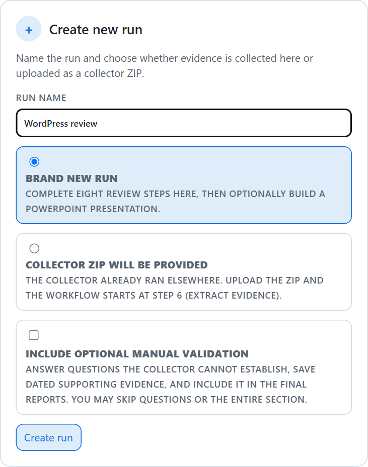

*Choose your evidence route and whether to include manual questions before selecting Create run. This example form has not been submitted.*

### Fresh collection

1. In **Create new run**, enter a meaningful **Run name**, such as `Production WordPress - October review`.
2. Select **Brand new run**.
3. Select **Include optional manual validation** if you want to answer questions the collector cannot establish. Otherwise leave it unchecked.
4. Select **Create run**.
5. Confirm the new run is selected in the workflow header.

Continue with Step 1.

### Existing customer evidence ZIP

1. Enter a **Run name**.
2. Select **Collector ZIP will be provided**.
3. Use **Collector ZIP file** to select the complete archive produced by the collector.
4. Choose whether to include optional manual validation.
5. Select **Create run** and wait for the upload/staging result.

The canvas stages a local copy and starts the review route at **Step 6**. Steps 1-5 are bypassed for this route; that does not mean a fresh Azure collection has occurred.

You do not extract the ZIP yourself. The current upload limit is **200 MB**; if the archive is rejected, stop and ask Copilot to diagnose the package or supported input route rather than repeatedly creating runs.

### Existing saved run

In **Open existing run**, select the intended run. Confirm its scope and source type. The canvas restores its state, logs, and artifact references.

Use this to resume, not to imply that old evidence represents today's Azure configuration. For a new point-in-time review, create a new run.

## How to operate the canvas

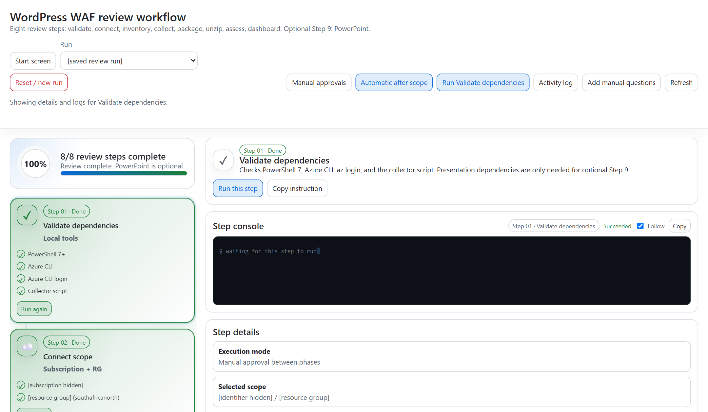

*The stage list is on the left; the selected stage's action and console are on the right. This saved run has already completed the eight required stages.*

| Canvas control | How to use it |
|---|---|
| Stage card | Select it to inspect that stage. Selecting a card alone does not execute its action. |
| **Run this step** | Execute the selected stage through the canvas. For completed stages the card may say **Run again**. |
| Top action button | Runs the selected stage; its label may name that stage. Check your selection before clicking. |
| **Step console** | Shows that stage's output, status, and timestamps. Use **Follow** to stay with incoming output. |
| **Activity log** | Opens the broader run history rather than only the selected stage's output. |
| **Refresh** | Refreshes workflow state and discovered artifacts. It is not a new Azure collection. |
| **Manual approvals** | You click to run each stage, but the **canvas still executes it**. This does not mean manually running scripts. |
| **Automatic after scope** | Enables sequential execution after scope selection. If waiting, use **Run automatic phases** to start/resume eligible stages. |
| **Copy instruction** / **Copy current instruction** | Diagnostic/fallback controls. They are not required for the normal canvas-driven path. |

For a first review, **Manual approvals** makes each result easy to inspect. If you prefer fewer clicks, select **Automatic after scope** before saving the Azure scope.

Automatic mode is not unattended execution of everything: it pauses for scope selection, the optional human-answer checkpoint, and the Copilot assessment handoff. It can submit the assessment request, but does not turn the skill into a synchronous local helper. Watch the phase state and chat rather than submitting the same assessment twice. PowerPoint is never started automatically.

The workflow has **eight required stages**, plus optional **6M** and **9**. Your review can finish at **8/8** with no deck.

## Step 1 - Validate dependencies

**In the canvas**

1. Select **Validate dependencies**.
2. Select **Run this step**.
3. Inspect the individual dependency results and the **Step console**.

**What the canvas does:** runs the prerequisite helper to check PowerShell 7, Azure CLI, Azure login, and the collector script.

**Ready to continue:** the required checks pass and the stage completes.

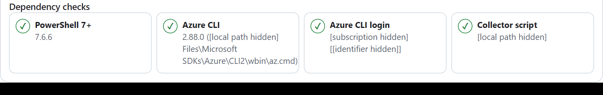

*Inspect each check, not just the overall completion indicator. Versions shown are examples, not pinned installation requirements.*

**If blocked:** use the failed check to ask Copilot for setup assistance. Installation or Azure sign-in may require action outside the canvas. Return to this card and use **Run again** after resolving it. The dependency checker does not install tools or grant access.

## Step 2 - Connect scope

**In the canvas**

1. Select **Connect scope**.
2. Select **Load subscriptions** if the list has not populated.
3. Choose the intended **Subscription**.
4. Select **Load resource groups** if necessary, then choose the **Resource group**.
5. Review both selections and select **Use selected scope**.
6. If the phase still offers an execution action, select **Run this step** to complete it.

**What the canvas does:** queries available Azure scopes and stores the selected subscription/resource group with this run.

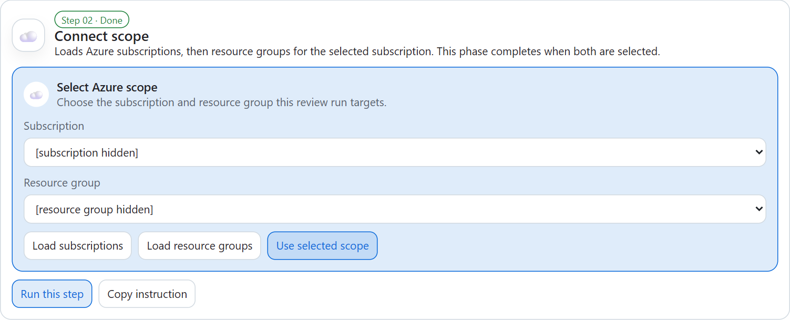

*Choose the subscription first, then the resource group. Identifiers are hidden in this example.*

**Ready to continue:** the saved scope is correct and the stage is complete. In automatic mode, saving scope may start the next stages; observe the console before clicking another action.

**If blocked:** ask Copilot to help check the Azure tenant, sign-in, and read access. Do not select a different environment simply because it appears in the list.

## Step 3 - Pre-assess

**In the canvas**

1. Select **Pre-assess**.
2. Select **Run this step**, unless automatic mode is already running it.
3. Review the resource inventory shown in the stage details.

**What the canvas does:** inventories the resource group and writes a pre-assessment JSON artifact.

**Ready to continue:** inventory completes and the resources match the intended scope.

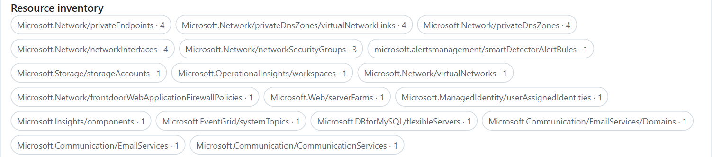

*The inventory summarizes discovered resource types; the counts belong to this example environment.*

This step is discovery, **not** a scored assessment. Investigate unexpected scope or missing components before collecting. Resources outside the selected group or unsupported resource types may need explicit scope limitations or additional evidence.

## Step 4 - Collect data

**In the canvas**

1. Select **Collect data**.
2. Select **Run this step** if it is not already running automatically.
3. Follow the collector's messages in the **Step console**.
4. When finished, review the displayed evidence paths and warnings.

**What the canvas does:** invokes the read-only collector against the selected Azure scope. It captures redacted per-resource JSON, inventory, a collection manifest, and a ZIP.

**Ready to continue:** the collection stage finishes and identifies its evidence output and archive.

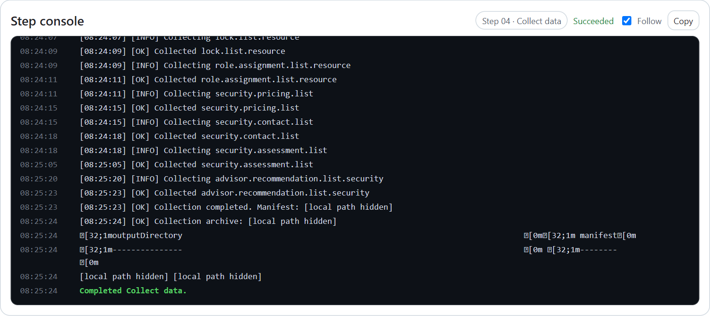

*The console keeps output tied to the selected stage. These are saved collection logs; a completed collection can still contain evidence gaps.*

**Do not equate "Succeeded" with full evidence coverage.** Individual API calls can fail even when the overall collection completes. Retain warnings and failed sections: the assessment uses them to explain missing evidence. If needed, ask Copilot to inspect collection gaps for the current run rather than rerunning scripts manually.

The collector does not remediate findings, change firewall settings, or perform restore tests.

## Step 5 - Package data

**In the canvas**

1. Select **Package data**.
2. Select **Run this step**, or inspect its completed automatic result.
3. Confirm the package displayed belongs to this collection.

**What the canvas does:** confirms the ZIP already produced by the collector and carries its path forward.

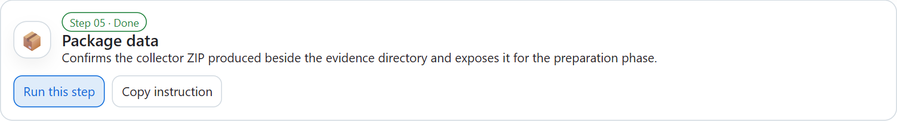

*Use the package stage to confirm the archive from the collection; you do not create another ZIP manually.*

**Ready to continue:** the package path is available and the stage completes.

You do not create a ZIP manually. If the package is missing, investigate the collection/package logs before continuing.

## Step 6 - Pre-Assess Phase: extract and prepare evidence

This is the first executable review stage when you supplied a collector ZIP.

**In the canvas**

1. Select **Pre-Assess Phase**.
2. Select **Run this step**, unless it is already running automatically.
3. Review the extracted evidence directory, manifest discovery, and JSON checks shown in the stage details.

**What the canvas does:** extracts the selected archive, finds `collection-manifest.json`, and prepares the actual evidence directory for the skill. It handles the nested folder inside a collector ZIP.

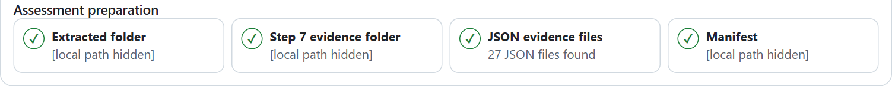

*The preparation results identify the evidence handed to Step 7. The JSON count varies by collection.*

**Ready to continue:** the manifest and evidence JSON are located. If manual validation was enabled, proceed to **6M**; otherwise proceed to **Step 7**.

Despite its label, this stage does not score the workload. Do not unzip the package separately or paste a different evidence path into chat during this flow; let the run carry its selected input forward.

## Step 6M - Optional manual validation

This section appears when you selected **Include optional manual validation**. On an existing run, use **Add manual questions** to enable it.

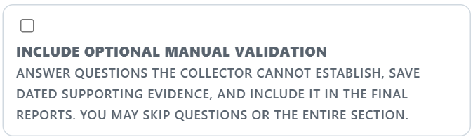

*Enable this option at run creation to add the questionnaire between extraction and assessment. This screenshot shows the opt-in only; it does not show saved answers.*

**In the canvas**

1. Select the manual-validation stage.
2. Review the suggested questions. Use **All checklist controls** to find additional controls you want to address.
3. Select a question and enter the claimed outcome, explanation, respondent/approver, evidence date, and supporting references.
4. Select **Save answer** for each response you want included.
5. When ready, choose **Continue with saved answers**.

Alternatively, choose **Skip manual validation**. This retains saved answers locally but excludes them from that assessment.

**What the canvas does:** persists answers and revision history for the run, then freezes an immutable assessment snapshot when you continue or skip. The generated skill request identifies the snapshot to use.

**Ready to continue:** you have explicitly continued with saved answers or skipped. You do not need to answer every question; missing or unsupported answers can remain `Not verified`.

The questions include operational/process controls and evidence gaps across the checklist. A claim such as "recovery is tested" does not automatically produce a Pass: provide dated supporting evidence. The skill evaluates these as **user-provided manual evidence**.

Do not leave unsaved edits before starting another step. If you change saved answers after assessment, the reports and downstream completion state become stale. Continue with the new snapshot, rerun Step 7, then refresh/reopen Step 8 and regenerate Step 9 if needed.

## Step 7 - Assessment Phase

**In the canvas**

1. Select **Assessment Phase**.
2. Check the evidence/output context and manual-validation selection.
3. Select **Run this step** if the phase has not already submitted a skill request.
4. Watch the skill activity and individual report indicators.
5. Respond in the accompanying Copilot chat only if permissions or clarification are requested.

**What the canvas does:** prepares and submits the `wordpress-waf-review` skill request to Copilot using this run's evidence, intended output directory, and selected manual snapshot. It monitors the three report artifacts as the skill works.

**What Copilot does:** assesses the evidence against the 157-control checklist and writes:

- `executive-summary.md`
- `detailed-well-architected-review.md`
- `findings.csv`

**Ready to continue:** all three report indicators are complete for this run, and Step 8 becomes available. A submitted request alone is not a completed assessment.

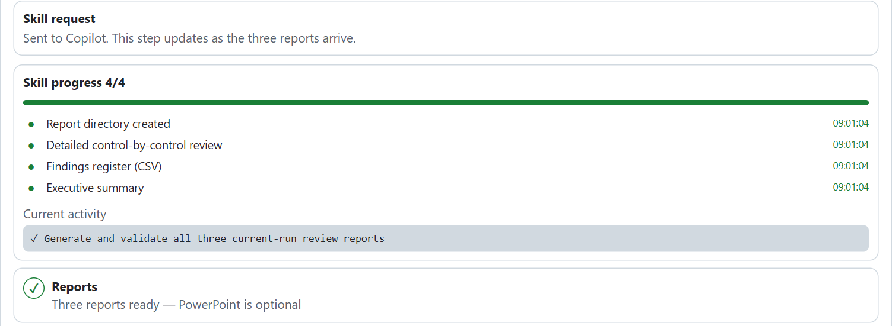

*The 4/4 indicator counts the report directory plus the three report files. It does not mean four reports or include a PowerPoint.*

You do **not** need to type a separate `/wordpress-waf-review` command, copy the generated prompt, or run a report script in a terminal. Those are fallback techniques, not the normal route in this guide.

If the stage is waiting, inspect chat and the step console first. Use **Refresh** once the skill has finished if artifact status has not updated. Do not launch duplicate skill requests while one is active.

## Step 8 - Display

**In the workflow canvas**

1. Select **Display**.
2. Select **Run this step**.
3. Wait for Copilot to open the dashboard canvas for the report directory supplied by the workflow.
4. Confirm that the dashboard is showing the intended review.

**What the canvas does:** submits the request to open `waf-review-dashboard` with the finished report directory. You do not need to enter a canvas tool call or browse to a local server URL.

**Ready to continue:** the dashboard opens and its report content is available. The required workflow can now show **8/8 complete**.

### Explore the dashboard

| Dashboard tab | Actions to try |
|---|---|
| **Overview** | Read the review context, score with coverage, strengths, and top risks. |
| **Pillars** | Compare status composition and coverage across report sections. |
| **Controls** | Search for a control ID, filter statuses, and click a square or row for evidence and recommendations. |
| **Findings** | Filter by status/priority, compare severity and effort, and open finding details. |
| **Plan & gaps** | Review proposed remediation, resources in scope, and collection limitations. |

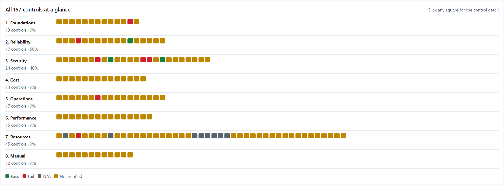

*Each square represents a control. Select a square to inspect its evidence rather than relying on color alone.*

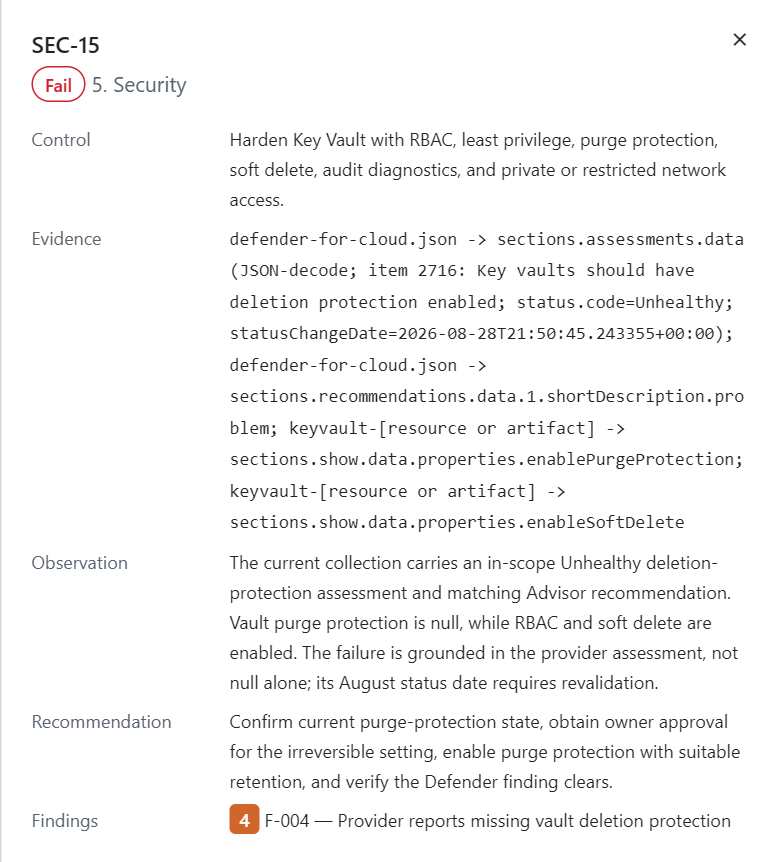

*An example control drawer connects the assessed status to evidence and a recommendation. This is a saved review result, not a statement about your environment.*

Treat `Not verified` as missing or insufficient evidence, not a confirmed failure. A high-priority verification item is not automatically a confirmed vulnerability. Always read coverage alongside score; if the written report says the headline is `n/a`, do not substitute a percentage based on only the decided sections.

The dashboard reads the two Markdown reports and CSV, not the evidence ZIP or presentation. It does not change Azure resources. Agree remediation owners and actions separately.

## Step 9 - PowerPoint, optional

The review is already usable without this stage.

**One-time prerequisite:** the presentation generator needs Node.js 20+ and its pinned local dependencies. The canvas displays setup guidance but does not automatically install them. If needed, ask Copilot:

> Prepare the optional presentation generator dependencies for this repository. Do not rerun the assessment. I will then generate the deck from Step 9 in the workflow canvas.

Review and approve any setup actions. Then return to the canvas; no manual deck-generation command is required.

**In the canvas**

1. Select **PowerPoint (optional)**.
2. Choose **Executive** for the concise readout or **Detailed** for expanded findings.
3. Leave **Render changed slides** off unless you have working desktop PowerPoint on Windows and want slide-image exports.
4. Select **Generate PowerPoint**.
5. Watch this stage's console for completion, slide count, timing, and cache status.
6. Use the resulting deck path to open the artifact in the app, or ask Copilot to open the generated PowerPoint.

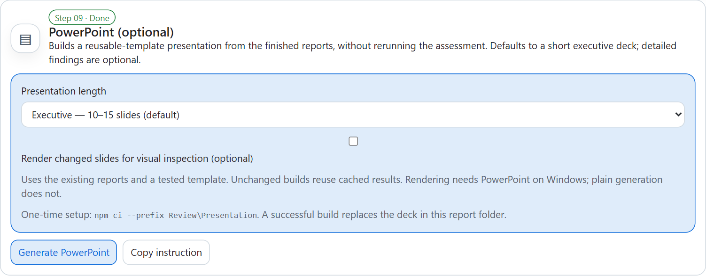

*Choose the presentation length and leave rendering off unless you need it. Generate PowerPoint reuses the finished reports.*

**What the canvas does:** runs the local generator against the existing three reports. Identical inputs can reuse a validated cached build.

**Done:** `well-architected-review.pptx` is published in the report directory. No second assessment is performed.

Successful regeneration replaces the deck, including when you change mode. Preserve a copy first if you need both versions. Generation failure does not block the reports/dashboard, and the previous deck is preserved.

## Artifacts: follow them through the canvas

You do not need to assemble these files manually. Use the paths shown in stage details; ask Copilot to open a displayed artifact if it is not a clickable link.

| Canvas stage | Artifact | Purpose and typical location |
|---|---|---|
| Start screen / all stages | Run registry | `waf-review-workflow-runs.json` in the configured workspace root; stores named runs, scope, state, logs, preferences, and artifact references. |
| Step 3 | Pre-assessment inventory | `Review\pre-assessment\pre-assessment-<resource-group>.json`; scope discovery, not final scoring. |
| Step 4 | Collected JSON evidence | Run-specific directory under `Evidence\`; raw assessment inputs with secrets redacted. |
| Step 4 | `collection-manifest.json` | Index of evidence files, collection scope/date, unsupported resources, and top-level errors. |
| Step 4 | Resource-group and per-resource JSON | Inventory and service-specific sections with commands, outcomes, errors, and captured values. |
| Step 5 | Collector ZIP | Portable complete evidence package created during collection and confirmed here. |
| ZIP start route | Staged upload | Local copy under `Evidence\Uploaded\<run-id>\`. |
| Step 6 | Extracted package | Under `Evidence\Extracted\<archive-name>\`; the manifest-containing folder is passed to the skill. |
| Step 6M | Saved answers and history | `Review\manual-validation\<run-id>\answers.json`; saved separately for each run. |
| Step 6M | Assessment snapshot | `assessment-r<revision>-<unique-id>.json` beside the answers; fixes the manual evidence revision used, or records that it was skipped. |
| Step 7 | `executive-summary.md` | Leadership scorecard, evidence coverage, strengths, risks, and priorities. |
| Step 7 | `detailed-well-architected-review.md` | Full control register, evidence pointers, observations, recommendations, and gaps. |
| Step 7 | `findings.csv` | Prioritized failed or materially unverified controls for tracking/import. It does not automatically create work items. |
| Step 8 | Dashboard canvas | Interactive view of the three reports, not another independent assessment or a replacement for source files. |
| Step 9 | `well-architected-review.pptx` | Optional readout derived from the reports. |
| Step 9 | `.presentation-cache\` | Internal build/cache metadata and optional render images within the report directory. |

The default report directory is `Review\reports\<evidence-folder-name>-reports\`. Use the directory displayed by the workflow rather than guessing from the run name. Regenerating the same evidence normally rewrites that report set.

The repository components have distinct responsibilities: **extensions execute actions and host canvases; the workflow canvas coordinates; the skill assesses; the dashboard displays**. None of them automatically remediates the Azure workload.

## Resume or repeat through the canvas

**Resume:** open the workflow, select **Start screen**, and choose the saved run, or use the run selector. Confirm that its referenced files still exist. Avoid **Reset / new run** when your intention is only to inspect previous results.

**Repeat with fresh evidence:** create a new named run and follow Steps 1-8. For another customer package, create a ZIP-based run and continue from Step 6.

**Add answers later:** reopen the run, select **Add manual questions**, save responses, continue with the snapshot, and rerun Steps 7-8. Regenerate Step 9 only if a deck is wanted.

**Retain the review:** keep the evidence package, all three reports, relevant manual snapshot/history, supporting evidence, and any deck. Keep the registry and referenced paths if you want the canvas to resume the run. The registry is not a backup of the files themselves.

**Share deliberately:** review reports and evidence for confidential metadata before transfer. The current Git ignore rules exclude `Evidence\` and manual-validation data, but do not generally exclude reports, pre-assessment inventory, or the run registry. Do not commit a customer's generated artifacts unintentionally.

## When a canvas step is blocked

Stay with the selected run and use its status/logs to diagnose the issue. Ask Copilot to help with **that stage**, then retry it through the canvas after the cause is resolved.

| What you see | Canvas-first response |
|---|---|
| **Waiting for previous step** | Inspect the preceding required stage. Complete it, or explicitly continue/skip manual validation. Do not bypass gating with a separate script. |
| Failed dependency check | Ask for help preparing the missing tool or completing Azure sign-in; return to Step 1 and retry. |
| Empty scope dropdowns | Use **Load subscriptions** / **Load resource groups**. Ask Copilot to check the tenant and access if they remain empty. |
| Collection access/network errors | Inspect Step 4 logs and request approved access/connectivity fixes from the resource owner. Do not weaken resource security. |
| ZIP cannot be prepared | Check the upload result and Step 6 console. Supply a complete collector archive, not a ZIP containing only reports. |
| Manual save conflict | Refresh the questionnaire and reconcile with the latest saved revision. Do not edit `answers.json` directly. |
| Skill request submitted, reports incomplete | Check Copilot chat for approvals, questions, or failure. Wait for the existing request rather than clicking repeatedly. |
| Reports exist but workflow has not advanced | Select **Refresh** and inspect all three report indicators and expected paths. Ask Copilot to inspect state if they disagree. |
| Wrong/old dashboard results | Confirm the selected workflow run, rerun Step 8 to open its report directory, and ask Copilot to refresh the dashboard from disk if needed. |
| Optional PowerPoint fails | Inspect Step 9's console. Resolve dependencies or report-format errors with Copilot, then retry **Generate PowerPoint**. Keep using the existing dashboard meanwhile. |
| Deck is locked or rendering fails | Close the file in desktop PowerPoint before replacing it. Disable optional slide rendering if ordinary generation is sufficient. |

For background/reference material, see [howtorun.md](howtorun.md). For implementation details, see the [workflow README](.github/extensions/waf-review-workflow/README.md) and [dashboard README](.github/extensions/waf-review-dashboard/README.md).
